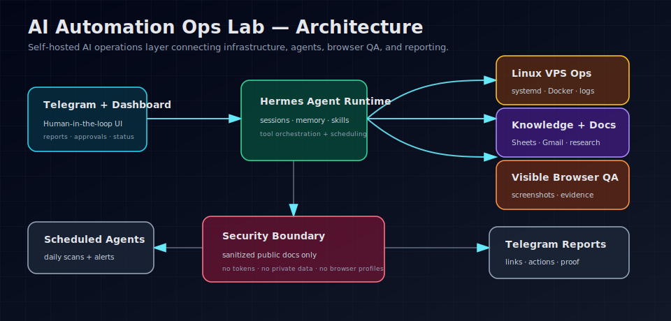
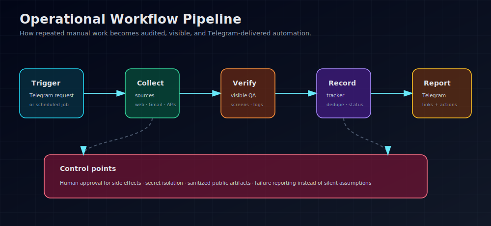
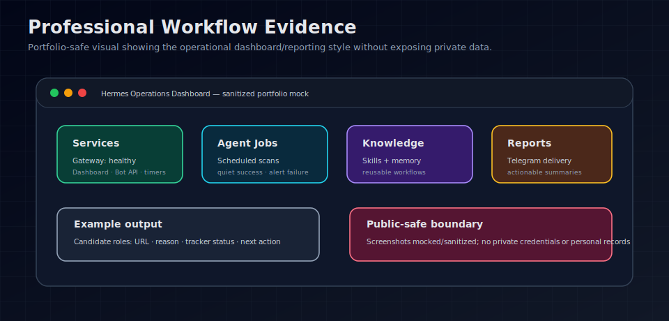

# AI Automation Ops Lab

A portfolio-safe case study showing how I designed and operated a private AI automation layer on a Linux VPS, connecting infrastructure operations with modern AI-agent workflows.

This repository is intentionally **sanitized**: it does not include credentials, private job tracker data, browser profiles, production configuration, or personal records. It documents architecture, workflows, and engineering thinking in a way that can be reviewed safely.

## Live portfolio page

- https://gdc88.github.io/boris-ai-automation-ops-lab/

## Why this project matters

Many AI projects are simple prompt demos. This one is an operational automation layer: scheduled agents, Telegram delivery, browser-assisted workflows, document/research extraction, Google Sheets/Gmail integrations, monitoring, and repeatable runbooks.

It demonstrates how classic IT infrastructure skills can be combined with AI automation to reduce manual work and improve operational visibility.

## Visual overview

These portfolio-safe visuals show the professional workflow without exposing private data, credentials, browser sessions, or personal records.







More visual evidence:

- [Portfolio-safe screenshots and evidence mocks](docs/screenshots.md)
- [Hermes vs Cowork, OpenClaw, and Odysseus](docs/hermes-vs-cowork-openclaw-odysseus.md) — practical explainer of where a self-hosted operations layer fits versus interactive AI workspaces and local AI sandboxes.

## Capabilities demonstrated

- **Self-hosted operations:** Linux VPS, systemd services, Docker, local dashboard, monitoring.
- **Agentic workflows:** scheduled agents, tool-enabled tasks, browser automation, research extraction, report delivery.
- **AI-agent tool selection:** practical comparison of Hermes, Cowork-style workspaces, OpenClaw-style agents, and local AI workspaces such as Odysseus.
- **Messaging interface:** Telegram-first delivery for alerts, summaries, and task reports.
- **Career operations:** job-search tracking, CV/document workflow support, source review, publication-ready reporting.
- **Visible-browser QA:** screenshot/recording-based verification for browser workflows.
- **Security awareness:** no secrets in repo, public-safe architecture, clear separation between private system and portfolio documentation.

## Repository structure

```text
docs/
  architecture.md            High-level architecture and components
  case-studies.md            Sanitized workflow examples
  hermes-vs-cowork-openclaw-odysseus.md
                             Practical AI-agent landscape explainer
  screenshots.md             Portfolio-safe visual evidence mocks
  public-positioning.md      Public technical positioning text
  implementation-roadmap.md  How I would evolve this for a team/company
SECURITY.md                  Public-safe disclosure and secret-handling note
```

## Portfolio positioning

Suggested public portfolio project title:

> Private AI Automation Layer / Agentic OS for Personal Operations

Short description:

> Built and operated a self-hosted AI automation layer integrating Telegram, scheduled agents, browser automation, Google Sheets/Gmail workflows, research extraction, and VPS monitoring into practical day-to-day operations.

## Technology keywords

Linux VPS · Docker · systemd · Python · Telegram Bot API · Google Sheets/Gmail workflows · browser automation · AI agents · scheduled automation · monitoring · document workflows · research extraction · Hermes Agent

## What is not included

- API keys or tokens
- Private Telegram/Gmail/Google Sheets data
- Browser profiles or cookies
- Personal job tracker details
- Production server configuration
- Proprietary/private source data

## Interview talking point

> I built a self-hosted AI automation environment on a Linux VPS. It is not just prompt usage — it connects scheduled agents, Telegram delivery, browser automation, Google Sheets/Gmail workflows, research extraction, and infrastructure monitoring. I use it to run job-search scans, maintain an application tracker, summarize research sources, check VPS health, and assist with CV/document workflows.
## Portfolio evolution

This repository is part of an evolving AI-automation portfolio, not a one-off demo. The projects show a growth path from job-search automation and local MVPs toward safer IT/cloud/security operations with agentic workflows.

Current portfolio map:

- **[Hermes SecOps Copilot](https://github.com/gdc88/boris-hermes-secops-portfolio)** — Newest portfolio layer: Hermes/OpenClaw-style AI automation for cloud security operations, M365/Azure readiness, Copilot governance, and agentic workflows. Live page: https://gdc88.github.io/boris-hermes-secops-portfolio/
- **[AI Automation Ops Lab](https://github.com/gdc88/boris-ai-automation-ops-lab)** — Operational base layer: self-hosted AI automation patterns, Telegram delivery, scheduled agents, browser-assisted workflows, and infrastructure operations thinking.
- **[Ops Agent Playbook Runner](https://github.com/gdc88/ops-agent-playbook-runner)** — Engineering proof layer: safe, auditable, dry-run-first operations playbooks with evidence bundles and policy controls.
- **[AI Resume Adapter Bot](https://github.com/gdc88/ai-resume-adapter-bot)** — Career automation layer: ATS/job-description analysis and truthful resume tailoring workflow for the German market.
- **[JobMatch AI](https://github.com/gdc88/JobMatch-AI)** — Course/final-project layer: static MVP for job-match analysis, outreach draft generation, and portfolio demonstration.

Growth direction:

- Keep public repositories sanitized and public-safe.
- Prefer clear architecture, safety boundaries, screenshots/visuals, and evidence over private operational data.
- Update each project as the overall system matures: better runbooks, stronger guardrails, clearer German-market positioning, and more polished demos.
- Use GitHub as the proof layer for public technical growth.
