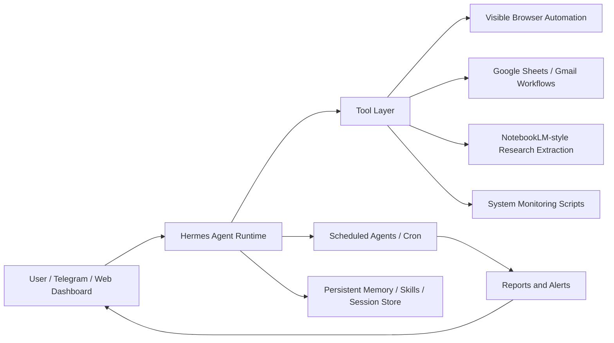

# Architecture

## High-level design

## Components

- **Linux VPS host:** Runs the self-hosted automation environment.
- **Hermes Agent runtime:** Core agent layer for tool-enabled tasks, scheduled jobs, sessions, and memory/skills.
- **Telegram interface:** Main delivery channel for reports, alerts, and task interaction.
- **Web dashboard:** Operational visibility for sessions, cron jobs, logs, models, usage, and system status.
- **Visible browser automation:** Used for workflows where web UI state matters and evidence is needed.
- **Google workflows:** Sheets/Gmail integration for tracking and operational data.
- **Research extraction:** YouTube/source review workflows using transcript/fulltext extraction and summarization.

## Engineering themes

- Human-in-the-loop operations where needed.
- Evidence-based automation: logs, screenshots, visible QA, and status reports.
- Token/cost awareness via summarization, session history, and scheduled workflows.
- Safe public/private separation: repo contains patterns and documentation, not private config.
