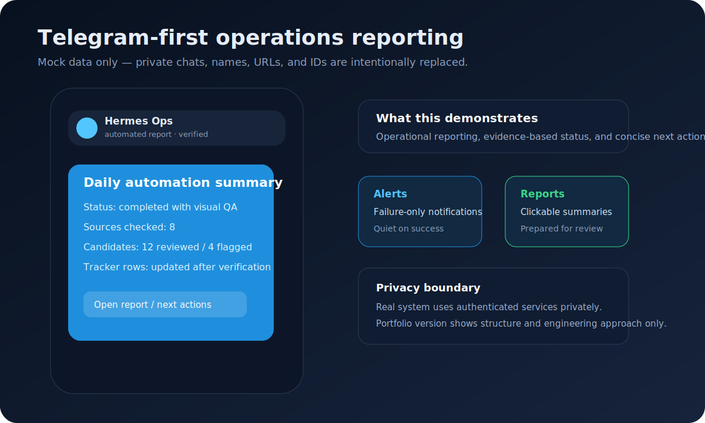
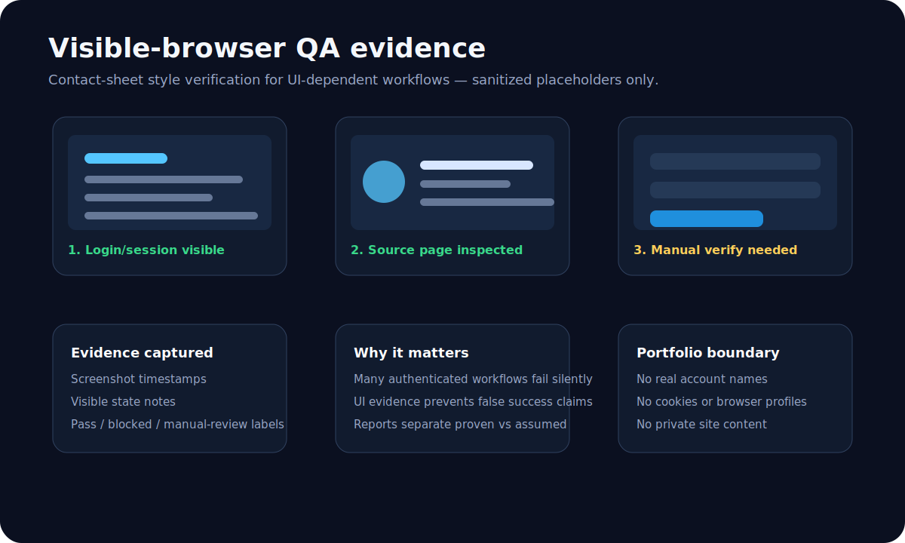
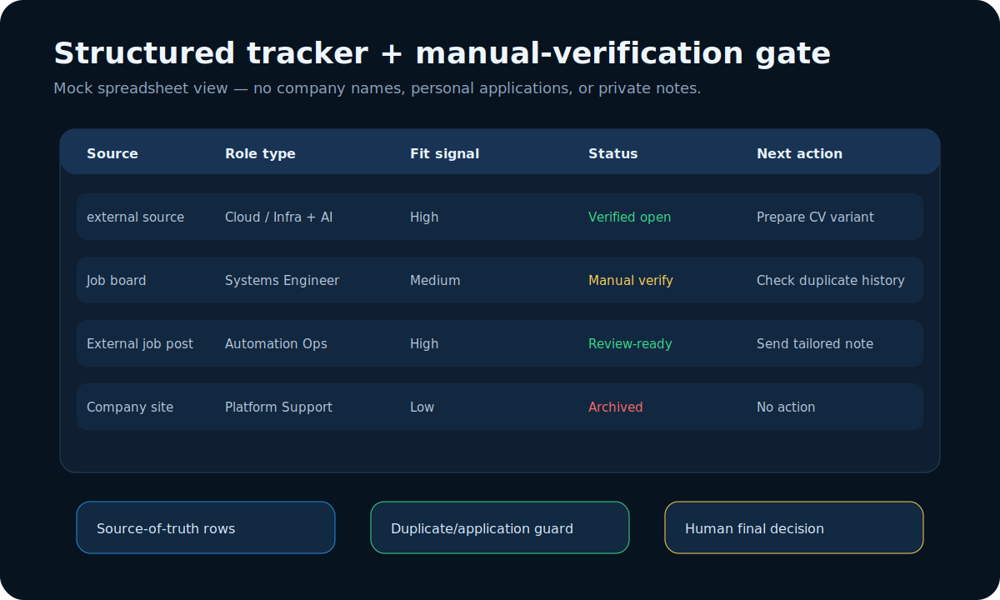
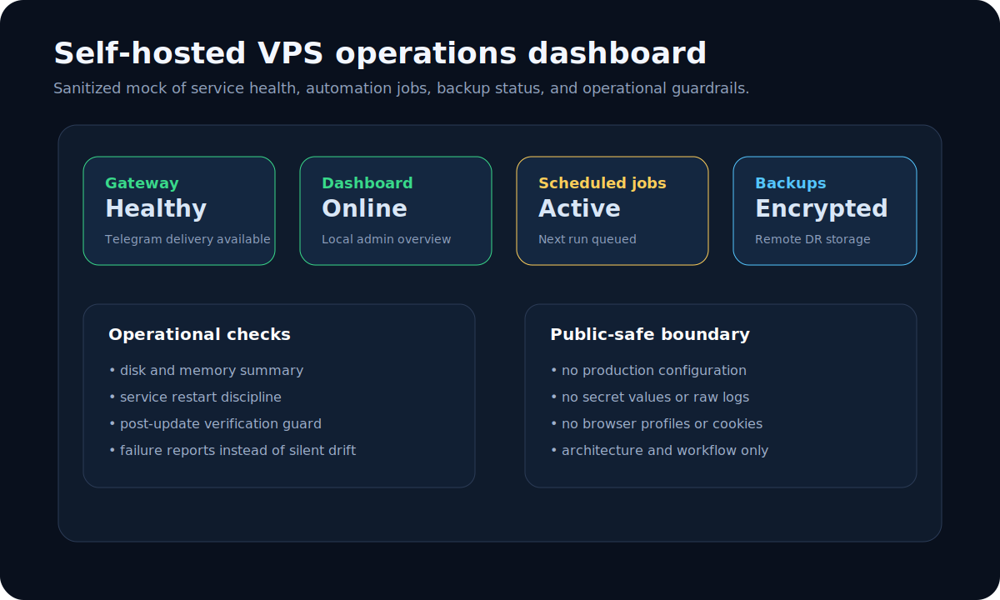

# Portfolio-safe screenshots and evidence mocks

This page shows sanitized visual evidence for the AI Automation Ops Lab. The images are intentionally **mocked and redacted**: they demonstrate the workflow shape, operational thinking, and reporting style without exposing private accounts, credentials, browser profiles, job-tracker rows, Gmail content, Telegram chats, or production configuration.

## 1. Telegram operations report

What it demonstrates:

- Telegram-first delivery for task reports, alerts, and next actions.
- Short operational summaries instead of raw logs.
- Clear separation between completed work, manual-review items, and blocked steps.
- Failure-only alerting discipline for recurring jobs.

## 2. Visible-browser QA contact sheet

What it demonstrates:

- Browser workflows are verified visually when page state matters.
- Screenshots/contact sheets provide evidence for authenticated or UI-dependent tasks.
- Reports distinguish what was visibly proven from what still needs human review.
- Raw recordings/screenshots are treated as private operational artifacts, not public portfolio material.

## 3. Job tracker workflow

What it demonstrates:

- Structured rows in a tracker instead of unstructured chat notes.
- Manual-verification gate before acting on promising items.
- Duplicate/application-history checks before follow-up.
- Human final decision remains part of the workflow.

## 4. VPS service health dashboard

What it demonstrates:

- Self-hosted service awareness: gateway, dashboard, scheduled jobs, backups.
- Guarded maintenance instead of blind restarts.
- Encrypted disaster-recovery backup posture.
- Public documentation boundary: architecture and workflow, not live secrets or logs.

## Public/private boundary

Included here:

- Sanitized architecture visuals.
- Mock operational screenshots.
- Workflow descriptions and engineering rationale.
- Public-review-safe evidence of system design.

Not included here:

- API keys, OAuth tokens, passwords, or cookies.
- Raw Telegram/Gmail/Sheets/browser data.
- Private job-search details or personal tracker rows.
- Production `.env`, service configs, database files, or session stores.
